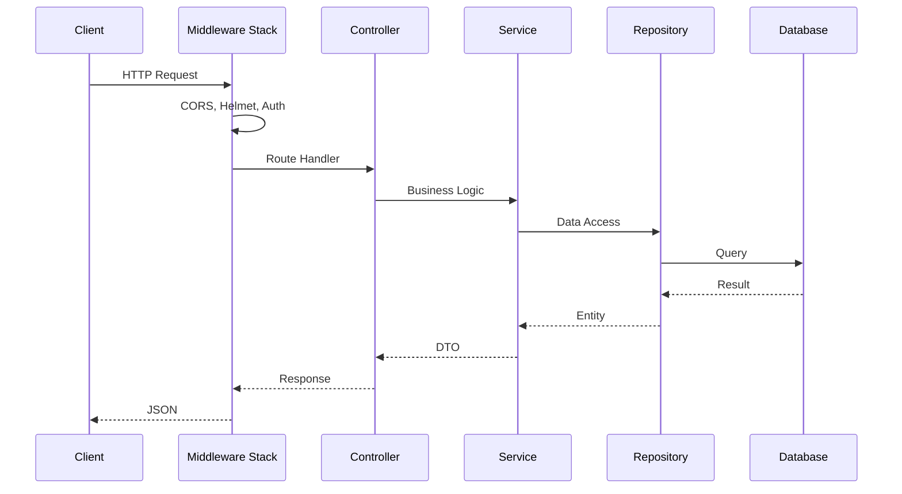
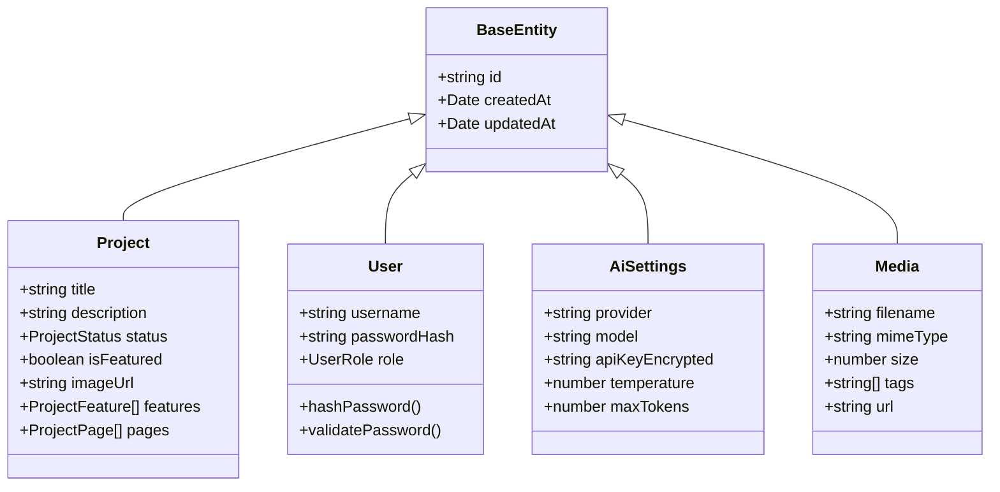

# Ark.Portfolio.Backend

The **Backend** is a robust Node.js/Express application providing RESTful APIs for the portfolio ecosystem. It features TypeORM for database interactions, multi-provider AI services, JWT authentication, and secure content management.

## 📦 Functional Capabilities

The backend serves as the secure, intelligent core of the ecosystem.

| Domain | Capability | Description | Code Reference |
| :--- | :--- | :--- | :--- |
| **API** | **REST Endpoints** | Structured controllers handling Auth, Admin, Project, and AI requests. | `src/controllers/*.controller.ts` |
| **Security** | **Authentication** | JWT-based auth with bcrypt hashing, RBAC, and Helmet headers. | `src/middleware/auth.middleware.ts` |
| **AI** | **Multi-Provider AI** | Unified interface for OpenAI, Anthropic, and Google Gemini with encrypted key storage. | `src/services/ai.service.ts` |
| **Export** | **Static Site Generation** | Generate deployable static websites from CMS content. | `src/services/static-export.service.ts` |
| **Media** | **Asset Management** | Upload, process, and serve media files with automatic optimization. | `src/services/media.service.ts` |
| **Data** | **Persistence** | TypeORM with SQLite supporting entity relationships and migrations. | `src/database/entities/` |
| **CMS** | **Content Management** | Full CRUD for Projects, Resume, Skills, and Media. | `src/services/admin-*.service.ts` |
| **DevOps** | **Auto-Seeding** | Automatic DB population on startup if empty. | `src/database/seeds/seed.ts` |

---

## 🏗️ Project Structure

```text
Ark.Portfolio.Backend/
├── src/
│   ├── config/          # Database, Swagger, CORS configuration
│   ├── controllers/     # Request handlers
│   │   ├── admin.controller.ts
│   │   ├── auth.controller.ts
│   │   ├── project.controller.ts
│   │   └── ai.controller.ts
│   ├── database/
│   │   ├── entities/    # TypeORM entities
│   │   └── seeds/       # Initial data seeding
│   ├── middleware/      # Auth, Error, Logging
│   ├── services/        # Business logic
│   │   ├── ai.service.ts
│   │   ├── auth.service.ts
│   │   ├── media.service.ts
│   │   └── static-export.service.ts
│   └── index.ts         # Entry point
├── uploads/             # Media file storage
├── static-export/       # Generated static sites
└── portfolio.db         # SQLite database
```

---

## 📐 Architecture

### Request Flow



### Core Entities



---

## 🔌 API Endpoints

### Public Endpoints

| Method | Endpoint | Description |
|--------|----------|-------------|
| `GET` | `/api/projects` | List all projects |
| `GET` | `/api/projects/:id` | Get project details |
| `GET` | `/api/resume` | Get resume data |
| `GET` | `/api/profile` | Get profile info |
| `GET` | `/api/carousel` | Get carousel slides |

### Authentication

| Method | Endpoint | Description |
|--------|----------|-------------|
| `POST` | `/api/auth/login` | User login |
| `POST` | `/api/auth/logout` | User logout |
| `GET` | `/api/auth/verify` | Verify JWT token |

### Admin Endpoints (Protected)

| Method | Endpoint | Description |
|--------|----------|-------------|
| `GET` | `/api/admin/projects` | List projects (admin) |
| `POST` | `/api/admin/projects` | Create project |
| `PUT` | `/api/admin/projects/:id` | Update project |
| `DELETE` | `/api/admin/projects/:id` | Delete project |
| `POST` | `/api/admin/media/upload` | Upload media |
| `POST` | `/api/admin/export/static` | Generate static site |

### AI Endpoints (Protected)

| Method | Endpoint | Description |
|--------|----------|-------------|
| `GET` | `/api/ai/settings` | Get AI configuration |
| `PUT` | `/api/ai/settings` | Update AI settings |
| `POST` | `/api/ai/test` | Test AI connection |
| `POST` | `/api/ai/generate` | Generate content |

---

## ⚙️ Configuration

### Environment Variables

Create a `.env` file in the Backend root:

```env
# Server
PORT=3085
NODE_ENV=development

# Database
DATABASE_TYPE=sqlite
DATABASE_NAME=portfolio.db

# Authentication
JWT_SECRET=your-256-bit-secret-key
JWT_EXPIRES_IN=24h
BCRYPT_ROUNDS=12

# AI Providers (encrypted in DB)
OPENAI_API_KEY=sk-...
ANTHROPIC_API_KEY=sk-ant-...
GOOGLE_AI_API_KEY=...

# CORS
CORS_ORIGIN=http://localhost:3080

# File Upload
MAX_FILE_SIZE=10485760
UPLOAD_PATH=./uploads

# Static Export
EXPORT_PATH=./static-export
```

---

## 🚀 Usage

### Prerequisites

- Node.js v18+
- `@ark/portfolio-share` built and available

### Development Server

```bash
npm install
npm run dev
# Server runs on https://localhost:3085
```

### Production Build

```bash
npm run build
npm start
```

### Database Seeding

```bash
npm run seed
```

### API Documentation

Once running, visit: [https://localhost:3085/api-docs](https://localhost:3085/api-docs)

---

## 🔒 Security Features

| Feature | Implementation |
|---------|----------------|
| Password Hashing | bcrypt (12 rounds) |
| JWT Tokens | HS256, 24h expiry |
| API Key Encryption | AES-256 for AI keys |
| Security Headers | Helmet.js |
| CORS | Configured whitelist |
| Input Validation | Zod schemas |

---

## 🧪 Testing

```bash
# Run tests
cd ../Ark.Portfolio.Tests
npm test -- --testPathPattern=Backend
```

---

<div align="center">
  <sub>Armand Richelet-Kleinberg © M2H.IO - Ark Alliance Ecosystem</sub><br>
  <sub>AI-assisted development with Anthropic Claude & Google Gemini</sub>
</div>
