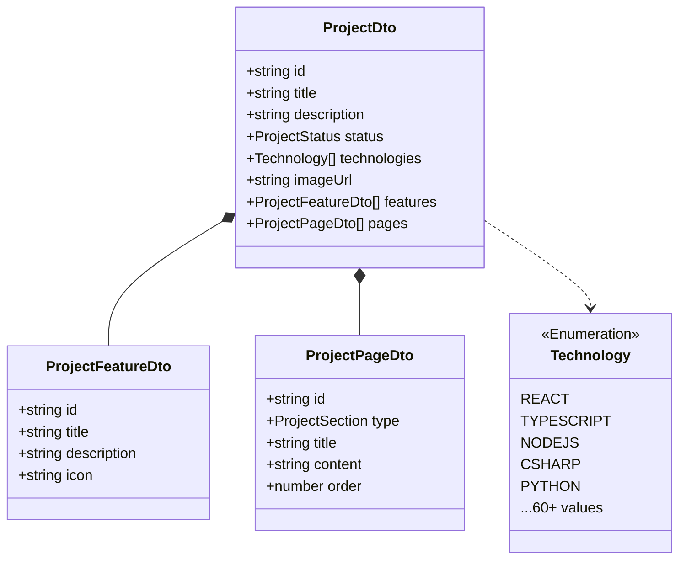
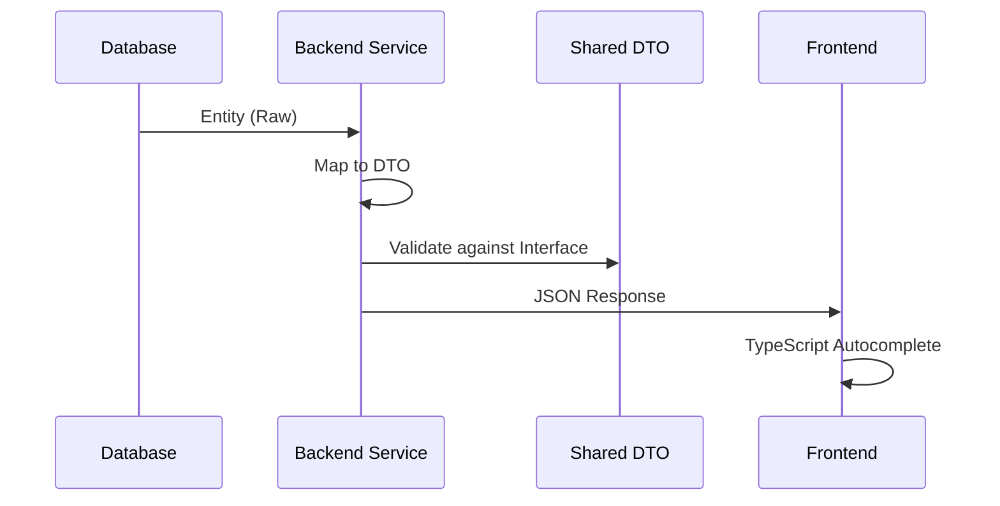

# Ark.Portfolio.Share

The **Shared Library** serves as the contract layer between Frontend and Backend, ensuring type safety and consistency across the entire solution. It provides Data Transfer Objects (DTOs), Enumerations, Constants, and Mock data.

## 📦 Functional Capabilities

| Domain | Capability | Description | Code Reference |
| :--- | :--- | :--- | :--- |
| **Contracts** | **DTOs** | Centralized interfaces ensuring Frontend/Backend type parity. | `dtos/*.dto.ts` |
| **Type Safety** | **Enums** | Strict enumerations for statuses, technologies (60+ values), and categories. | `enums/*.enum.ts` |
| **Constants** | **Terminology** | Unified UI strings and layout configuration. | `constants/*.ts` |
| **Testing** | **Mock Data** | Static datasets synced with backend seeds for testing without API. | `mocks/*.mock.ts` |
| **Exports** | **Barrel File** | Clean public API via index.ts barrel export. | `index.ts` |

---

## 🏗️ Project Structure

```text
Ark.Portfolio.Share/
├── constants/           # Global UX strings & Layout config
│   ├── terminology.constants.ts
│   └── ui-layout.constants.ts
├── dtos/                # Data Transfer Objects (15 files)
│   ├── auth.dto.ts
│   ├── project.dto.ts
│   ├── resume.dto.ts
│   ├── ai.dto.ts
│   ├── media.dto.ts
│   └── ...
├── enums/               # Typed Enumerations (5 files)
│   ├── project-status.enum.ts
│   ├── technology.enum.ts     # 60+ technologies
│   ├── skill-level.enum.ts
│   └── ...
├── mocks/               # Static test data
│   ├── projects.mock.ts
│   ├── cv.mock.ts
│   └── profile.mock.ts
├── index.ts             # Public API barrel
├── package.json
└── tsconfig.json
```

---

## 📐 Architecture

### DTO Relationships



### Data Flow



---

## 📋 Technology Enum

The `Technology` enum contains **60+ values** organized by category:

| Category | Examples |
|----------|----------|
| **Frontend** | React, Angular, Vue, Svelte, Next.js, Three.js |
| **Languages** | TypeScript, Python, C#, Go, Rust, COBOL |
| **Runtimes** | Node.js, .NET 5-8, Unity, Unreal |
| **Databases** | PostgreSQL, MongoDB, Redis, SQLite |
| **Cloud** | AWS, Azure, GCP, DigitalOcean |
| **DevOps** | Docker, Kubernetes, Terraform |
| **AI/ML** | PyTorch, TensorFlow, OpenAI, Anthropic |
| **Patterns** | Microservices, CQRS, GraphQL, gRPC |

---

## 🚀 Usage

### Installation

This package is referenced locally within the monorepo:

```json
// package.json in UI or Backend
{
  "dependencies": {
    "@ark/portfolio-share": "file:../Ark.Portfolio.Share"
  }
}
```

### Import Examples

```typescript
// Import DTOs
import { ProjectDto, ResumeDto } from '@ark/portfolio-share';

// Import Enums
import { ProjectStatus, Technology } from '@ark/portfolio-share';

// Import Mock Data
import { MOCK_PROJECTS } from '@ark/portfolio-share';

// Create typed object
const project: ProjectDto = {
    title: "My Project",
    status: ProjectStatus.IN_PROGRESS,
    technologies: [Technology.REACT, Technology.TYPESCRIPT],
    description: "A great project"
};
```

### Build

```bash
npm install
npm run build
# Output in /dist
```

---

## 📦 Package Exports

The `index.ts` barrel file exports:

```typescript
// Enums
export * from './enums/project-status.enum';
export * from './enums/technology.enum';
export * from './enums/skill-level.enum';
// ... 5 enum files

// DTOs
export * from './dtos/project.dto';
export * from './dtos/resume.dto';
export * from './dtos/auth.dto';
// ... 15 DTO files

// Constants
export * from './constants/terminology.constants';
export * from './constants/ui-layout.constants';

// Mocks
export * from './mocks/projects.mock';
export * from './mocks/cv.mock';
export * from './mocks/profile.mock';
```

---

## 🧪 Testing

Mock data is used by the test suite:

```typescript
import { MOCK_PROJECTS } from '@ark/portfolio-share';

describe('ProjectsPage', () => {
    it('renders projects from mock data', () => {
        // MOCK_PROJECTS contains 4 projects synced with backend seeds
        expect(MOCK_PROJECTS.length).toBe(4);
    });
});
```

---

## 📝 Adding New Types

### Adding a New DTO

1. Create `dtos/new-feature.dto.ts`:
   ```typescript
   export interface NewFeatureDto {
       id: string;
       name: string;
       // ...
   }
   ```

2. Export from `index.ts`:
   ```typescript
   export * from './dtos/new-feature.dto';
   ```

3. Rebuild:
   ```bash
   npm run build
   ```

### Adding a New Technology

Edit `enums/technology.enum.ts`:

```typescript
export enum Technology {
    // ... existing values
    
    /** New Technology */
    NEW_TECH = 'New Technology'
}
```

---

<div align="center">
  <sub>Armand Richelet-Kleinberg © M2H.IO - Ark Alliance Ecosystem</sub><br>
  <sub>AI-assisted development with Anthropic Claude & Google Gemini</sub>
</div>
