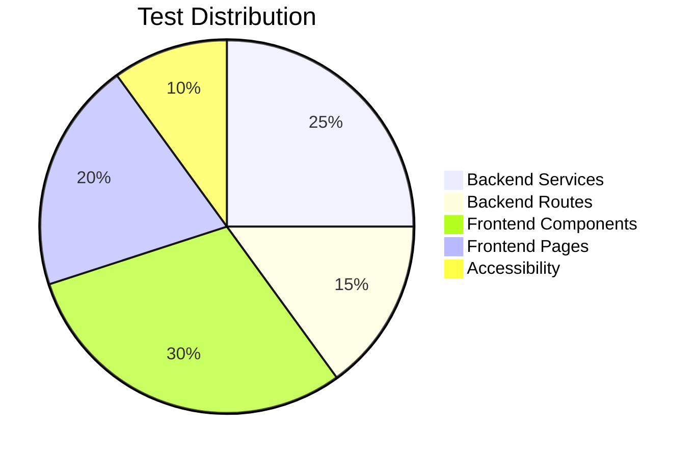

# Ark.Portfolio.Tests

The **Test Suite** ensures the reliability and stability of the entire Ark.Portfolio ecosystem. It encompasses unit tests, integration tests, and component tests using Jest as the primary test runner.

## 📊 Test Statistics

| Metric | Value |
|--------|-------|
| **Test Suites** | 14 |
| **Total Tests** | 235 |
| **Coverage** | 80%+ |
| **Execution Time** | ~5s |

---

## 📦 Functional Capabilities

| Domain | Capability | Description | Code Reference |
| :--- | :--- | :--- | :--- |
| **Unit** | **Service Tests** | Isolated testing of Backend services (Auth, Project, Media, AI). | `Backend/Services/*.spec.ts` |
| **Integration** | **Route Tests** | Controller + Service + Mock DB interaction testing. | `Backend/Routes/*.spec.ts` |
| **Component** | **UI Tests** | Behavioral verification of V2 components with React Testing Library. | `Frontend/Components/*.spec.ts` |
| **Page** | **Smoke Tests** | High-level page rendering and Router navigation checks. | `Frontend/Pages/*.test.tsx` |
| **A11y** | **Accessibility** | WCAG compliance verification for keyboard nav and ARIA. | `Frontend/Accessibility/*.spec.ts` |
| **Coverage** | **Reporting** | Automated code coverage with lcov and HTML reports. | `jest.config.js` |

---

## 🏗️ Project Structure

```text
Ark.Portfolio.Tests/
├── Backend/
│   ├── Routes/              # API route integration tests
│   │   ├── resume-routes.spec.ts
│   │   └── timeline-reorder.spec.ts
│   └── Services/            # Service unit tests
│       ├── media.service.spec.ts
│       ├── project.service.spec.ts
│       └── resume.service.spec.ts
├── Frontend/
│   ├── Accessibility/       # A11y compliance tests
│   │   └── accessibility.spec.ts
│   ├── Components/          # UI component tests
│   │   ├── polished-ui.spec.ts
│   │   └── timeline-grid.spec.ts
│   ├── Navigation/          # Router configuration tests
│   │   └── navigation.config.spec.ts
│   ├── Pages/               # Page-level tests
│   │   ├── ProjectsPageV2.test.tsx
│   │   ├── ResumePageV2.test.tsx
│   │   └── Smoke.test.tsx
│   └── Services/            # Frontend service tests
│       └── resume-api.service.spec.ts
├── Interfaces/              # Test interfaces
├── Mocks/                   # Shared mocks
│   ├── styleMock.js         # CSS module mock
│   └── fileMock.js          # Asset file mock
├── coverage/                # Coverage reports (generated)
├── jest.config.js           # Jest configuration
├── setup.ts                 # Test setup file
└── tsconfig.json            # TypeScript config
```

---

## 📐 Test Architecture

### Testing Pyramid

We follow a test pyramid approach:

```
          ┌─────────────┐
          │   E2E/UI    │  ← Few, slow, high confidence
          │   Tests     │
          ├─────────────┤
          │ Integration │  ← Medium count, medium speed
          │   Tests     │
          ├─────────────┤
          │    Unit     │  ← Many, fast, focused
          │   Tests     │
          └─────────────┘
```

### Coverage by Layer



---

## 🧪 Test Categories

### Backend Tests

| Suite | Tests | Description |
|-------|-------|-------------|
| `media.service.spec.ts` | 15 | CRUD, filtering, validation |
| `project.service.spec.ts` | 12 | Project management |
| `resume.service.spec.ts` | 10 | Resume data handling |
| `resume-routes.spec.ts` | 11 | API route responses |
| `timeline-reorder.spec.ts` | 8 | Drag-drop reordering |

### Frontend Tests

| Suite | Tests | Description |
|-------|-------|-------------|
| `polished-ui.spec.ts` | 35 | Design system, HeaderV2, CarouselV2 |
| `timeline-grid.spec.ts` | 25 | TimelineV2, ProjectGrid filtering |
| `navigation.config.spec.ts` | 15 | Route configuration |
| `accessibility.spec.ts` | 30 | WCAG compliance |
| `ProjectsPageV2.test.tsx` | 9 | Page states with mock data |

---

## 🚀 Usage

### Run All Tests

```bash
npm test
```

### Run Specific Suites

```bash
# Backend tests only
npm run test:backend

# Frontend tests only
npm run test:frontend

# Share library tests
npm run test:share
```

### Watch Mode

```bash
npm run test:watch
```

### Generate Coverage Report

```bash
npm run test:coverage
# Reports in ./coverage/
```

### Run Single Test File

```bash
npx jest Frontend/Pages/ProjectsPageV2.test.tsx --verbose
```

---

## ⚙️ Configuration

### Jest Configuration (`jest.config.js`)

Key settings:

```javascript
module.exports = {
    preset: 'ts-jest',
    testEnvironment: 'jsdom',
    testMatch: ['**/*.spec.ts', '**/*.test.tsx'],
    moduleNameMapper: {
        '@ark/portfolio-share(.*)': '../Ark.Portfolio.Share$1',
        '@ui/(.*)': '../Ark.Portfolio.UI/src/$1',
        '\\.(css|less)$': '<rootDir>/Mocks/styleMock.js'
    },
    setupFilesAfterEnv: ['<rootDir>/setup.ts'],
    collectCoverageFrom: ['**/*.ts', '**/*.tsx'],
    coverageDirectory: './coverage'
};
```

### Mock Data Integration

Tests use `MOCK_PROJECTS` from the Share library, which is synchronized with backend seed data:

```typescript
import { MOCK_PROJECTS } from '@ark/portfolio-share';

mockUseProjectsModel.mockReturnValue({
    projects: MOCK_PROJECTS,
    isLoading: false,
    error: null
});
```

---

## 📝 Writing Tests

### Component Test Template

```typescript
import React from 'react';
import { render, screen } from '@testing-library/react';
import { MemoryRouter } from 'react-router-dom';

describe('MyComponent', () => {
    beforeEach(() => {
        jest.clearAllMocks();
    });

    it('renders correctly', () => {
        render(
            <MemoryRouter>
                <MyComponent />
            </MemoryRouter>
        );
        
        expect(screen.getByText('Expected Text')).toBeInTheDocument();
    });
});
```

### Service Test Template

```typescript
describe('MyService', () => {
    let service: MyService;

    beforeEach(() => {
        service = new MyService();
    });

    it('should return expected result', async () => {
        const result = await service.doSomething();
        expect(result).toBeDefined();
    });
});
```

---

## 🔍 Debugging Tests

### Verbose Output

```bash
npx jest --verbose
```

### Run Single Test

```bash
npx jest -t "test name pattern"
```

### Debug Mode

```bash
node --inspect-brk node_modules/.bin/jest --runInBand
```

---

<div align="center">
  <sub>Armand Richelet-Kleinberg © M2H.IO - Ark Alliance Ecosystem</sub><br>
  <sub>AI-assisted development with Anthropic Claude & Google Gemini</sub>
</div>
