# Ark.Portfolio.UI

<div align="center">


**Modern React Frontend for the Ark.Portfolio Ecosystem**

*MVVM Architecture • Dynamic Theming • Admin CMS • Responsive Design*

</div>

---

The **Frontend** is a modern React application built with Vite and TypeScript. It features a polished, responsive user interface with MVVM architecture, multiple themes, deep linking, and a comprehensive admin dashboard with CMS capabilities.

## 📦 Functional Capabilities

The frontend delivers a premium, responsive experience with deep administrative control.

| Domain | Capability | Description | Code Reference |
| :--- | :--- | :--- | :--- |
| **UX/UI** | **Dynamic Theming** | Runtime theme switching (`Architectural` vs `Aloe Vera`) using CSS variables and React Context. | `src/styles/*-theme.css` |
| **Routing** | **Deep Linking** | URL-based state recovery for project details and sections, enabling shareable deep links. | `src/pages/ProjectDetails/v2/` |
| **CMS** | **Admin Dashboard** | Protected route suite for managing content (Projects, Media, Resume) without code changes. | `src/pages/Admin/` |
| **Export** | **Static Site Generation** | Export the entire portfolio as a static website for deployment on any host. | Admin Dashboard → Export |
| **Media** | **Asset Management** | Upload, organize, and optimize images and media with tag-based search. | `src/pages/Admin/MediaManager` |
| **AI** | **AI Configuration** | Configure and test AI providers (OpenAI, Anthropic, Google) for content generation. | `src/pages/Admin/AiSettingsPage` |
| **Security** | **Auth Context** | Global authentication state persistence and protected route guarding. | `src/contexts/AuthContext.tsx` |
| **Design** | **Atomic Components** | Reusable V2 component library (Cards, Buttons, Inputs) with strict design tokens. | `src/components/` |

---

## 🏗️ Project Structure

```text
Ark.Portfolio.UI/
├── 📁 src/
│   ├── api/                    # API client and service abstractions
│   │   └── client.ts           # Axios-based API client
│   │
│   ├── components/             # Reusable UI components (MVVM)
│   │   ├── HeaderV2/           # Header with navigation
│   │   ├── CarouselV2/         # Hero carousel
│   │   ├── TimelineV2/         # Resume timeline
│   │   ├── Toast/              # Toast notifications
│   │   └── generic/            # Base components (GlassCard, etc.)
│   │
│   ├── contexts/               # Global state providers
│   │   ├── AuthContext.tsx     # Authentication state
│   │   ├── ThemeContext.tsx    # Theme switching
│   │   └── ToastContext.tsx    # Toast notifications
│   │
│   ├── hooks/                  # Custom React hooks
│   │
│   ├── pages/                  # Route views
│   │   ├── Admin/              # CMS Dashboard (Protected)
│   │   │   ├── Dashboard/      # Admin home
│   │   │   ├── Projects/       # ⭐ Project management
│   │   │   │   ├── ProjectManager.tsx
│   │   │   │   └── ProjectEditPage.tsx
│   │   │   ├── Resume/         # Resume editor
│   │   │   ├── AiSettings/     # AI configuration
│   │   │   └── MediaManager/   # Asset management
│   │   ├── HomeV2/             # Landing page
│   │   ├── ResumeV2/           # Resume/CV page
│   │   ├── ProjectsV2/         # Projects grid
│   │   └── ProjectDetails/     # Project presentation
│   │
│   ├── services/               # Business logic layer
│   ├── styles/                 # CSS themes and global styles
│   ├── utils/                  # Utility functions
│   ├── App.tsx                 # Router & Provider setup
│   └── main.tsx                # Entry point
│
├── 📁 public/                   # Static assets
└── 📁 dist/                     # Production build output
```

---

## 🧠 MVVM Architecture

The application strictly adheres to the **Model-View-ViewModel (MVVM)** design pattern for scalability, testability, and separation of concerns.

### Pattern Structure

| Layer | File | Responsibility |
|-------|------|----------------|
| **Model** | `*.model.ts` | Type definitions, interfaces, state shape |
| **ViewModel** | `use*Model` hook | State management, side effects, business logic |
| **View** | `*.tsx` | Pure presentation, consumes ViewModel |
| **Styles** | `*.styles.css` | Component-specific styling |

### Component File Structure

```
ComponentName/
├── ComponentName.tsx        # View (presentation only)
├── ComponentName.model.ts   # ViewModel (state & logic)
├── ComponentName.styles.css # Styles
└── index.ts                 # Barrel export
```

### Data Flow

```mermaid
graph LR
    subgraph "MVVM Pattern"
        V[View<br/>📄 .tsx]
        VM[ViewModel<br/>🧠 useModel]
        M[Model<br/>📋 .model.ts]
    end
    
    V -->|User Action| VM
    VM -->|Updates State| VM
    VM -->|Re-renders| V
    VM -.->|Implements| M
```



---

## 📐 Component Hierarchy


---

## ⚙️ Configuration

### Environment Variables

Create a `.env` file in the UI root:

```env
# API Configuration
VITE_API_URL=https://localhost:3085/api
VITE_USE_MOCK_DATA=false

# Feature Flags
VITE_ENABLE_AI_FEATURES=true
VITE_ENABLE_STATIC_EXPORT=true

# Theme
VITE_DEFAULT_THEME=architectural
```

---

## 🚀 Usage

### Prerequisites

- Node.js v18+
- Backend running (optional for UI-only development with mock data)

### Development Server

```bash
npm install
npm run dev
# Server runs on http://localhost:3080
```

### Production Build

```bash
npm run build
# Output in /dist
```

### Preview Production Build

```bash
npm run preview
```

---

## 🎨 Theming

Two built-in themes are available:

| Theme | Description |
|-------|-------------|
| **Architectural** | Clean, structural aesthetic with sharp edges |
| **Aloe Vera** | Organic, nature-inspired with soft curves |

Toggle themes runtime via the Theme Context or Admin settings.

---

## 📱 Responsive Design

The UI is fully responsive with breakpoints:

| Breakpoint | Width | Layout |
|------------|-------|--------|
| Mobile | `< 768px` | Single column, hamburger menu |
| Tablet | `768px - 1024px` | Two columns |
| Desktop | `> 1024px` | Full layout |

---

## 📚 Related Documentation

| Document | Location | Purpose |
|----------|----------|--------|
| Share Layer | `../Ark.Portfolio.Share/README.md` | DTOs, enums, mocks |
| Backend Layer | `../Ark.Portfolio.Backend/README.md` | API endpoints |
| Tests Layer | `../Ark.Portfolio.Tests/README.md` | Test patterns, coverage |

---

<div align="center">

**Ark.Portfolio.UI** — Part of the Ark Alliance Ecosystem

<sub>
Armand Richelet-Kleinberg © M2H.IO<br>
AI-assisted development with Anthropic Claude & Google Gemini
</sub>

</div>
