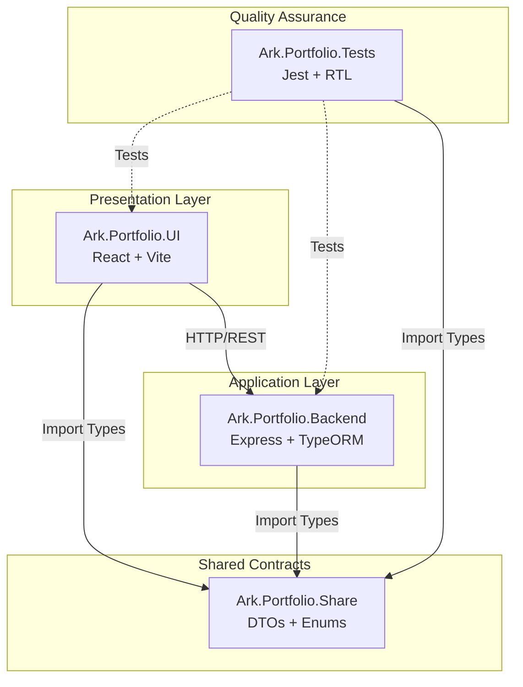

<p align="center">
  
</p>

<h1 align="center">Ark.Alliance.Portfolio</h1>

<p align="center">
  <strong>A comprehensive, AI-powered portfolio ecosystem with CMS capabilities</strong>
</p>

<p align="center">
  <a href="https://github.com/M2H-Machine-to-Human-Race/Ark.Alliance.Portfolio/actions/workflows/ci.yml">
    
  </a>
  <a href="https://github.com/M2H-Machine-to-Human-Race/Ark.Alliance.Portfolio/issues">
    
  </a>
  <a href="https://github.com/M2H-Machine-to-Human-Race/Ark.Alliance.Portfolio/pulls">
    
  </a>
  <a href="LICENSE.md">
    
  </a>
  
  
  
</p>

---

## 📖 Table of Contents

- [Overview](#-overview)
- [Key Features](#-key-features)
- [Project Structure](#-project-structure)
- [Architecture Layers](#-architecture-layers)
- [Getting Started](#-getting-started)
- [Configuration](#-configuration)
- [Deployment](#-deployment)
- [CI/CD](#-cicd)
- [Contributing](#-contributing)
- [Security](#-security)
- [License](#-license)

---

## 🌟 Overview

**Ark.Alliance.Portfolio** is a production-ready portfolio platform that goes beyond a simple showcase. It demonstrates enterprise-grade software engineering practices while providing a fully functional content management system.

### What Makes It Special

| Principle | Implementation |
|-----------|----------------|
| **Clean Architecture** | Strict separation across UI, Backend, and Shared contract layers |
| **AI Integration** | Multi-provider AI services (OpenAI, Anthropic, Google Gemini) for content generation |
| **Static Export** | Generate deployable static websites from CMS content |
| **Type Safety** | End-to-end TypeScript with shared DTOs ensuring API contract compliance |
| **Resilience** | Self-healing services, graceful fallbacks, and comprehensive error handling |
| **Design Excellence** | Adaptive theming, MVVM architecture, and accessibility-first components |

---

## 🚀 Key Features

### 🤖 AI-Powered Content Generation

Integrated AI services supporting multiple providers with encrypted API key storage:
- **OpenAI** (GPT-4, GPT-4 Turbo)
- **Anthropic** (Claude 3 Opus, Sonnet, Haiku)
- **Google Gemini** (1.5 Pro, 1.5 Flash)

Accessible via the Admin Dashboard under AI Settings for content generation, summarization, and enhancement.

### 📤 Static Website Export

Transform your portfolio into a deployable static website:
- One-click export from the Admin Dashboard
- Generates optimized HTML, CSS, and assets
- Ready for GitHub Pages, Netlify, or any static host
- Preserves all styling and interactivity

### 🖼️ Media Management

Comprehensive media handling through the CMS:
- Upload and organize images, videos, and documents
- Automatic thumbnail generation
- Tag-based organization and search
- CDN-ready asset optimization

### 🎨 Dynamic Theming

Runtime theme switching with two built-in themes:
- **Architectural** - Clean, structural aesthetic
- **Aloe Vera** - Organic, nature-inspired design

### 📊 Admin Dashboard

Full-featured content management:
- Project management with Mermaid diagram support
- Resume/CV editing with timeline components
- Skill and technology tagging
- Analytics and visitor insights (planned)

---

## 📂 Project Structure

```text
Ark.Portfolio/
├── .github/                    # GitHub Actions & Templates
│   └── workflows/              # CI/CD Pipelines
├── Ark.Portfolio.UI/           # Frontend (React/Vite/TypeScript)
├── Ark.Portfolio.Backend/      # Backend (Node.js/Express/TypeORM)
├── Ark.Portfolio.Share/        # Shared Library (DTOs, Enums, Types)
├── Ark.Portfolio.Tests/        # Unified Test Suite (Jest)
├── Docs/                       # Additional documentation
├── CONTRIBUTING.md             # Contribution guidelines
├── SECURITY.md                 # Security policy
├── LICENSE.md                  # MIT License
└── README.md                   # This file
```

---

## 🏗️ Architecture Layers

This solution follows a layered architecture pattern. Each layer has a specific responsibility and communicates through well-defined contracts.

| Layer | Module | Description | Documentation |
|-------|--------|-------------|---------------|
| **Frontend** | Ark.Portfolio.UI | React application with MVVM architecture, responsive design, and admin CMS | [📖 README](./Ark.Portfolio.UI/README.md) |
| **Backend** | Ark.Portfolio.Backend | RESTful API with authentication, AI services, and database persistence | [📖 README](./Ark.Portfolio.Backend/README.md) |
| **Shared** | Ark.Portfolio.Share | Type-safe contracts (DTOs, Enums) shared across the stack | [📖 README](./Ark.Portfolio.Share/README.md) |
| **Quality** | Ark.Portfolio.Tests | Comprehensive test suite with 235+ tests | [📖 README](./Ark.Portfolio.Tests/README.md) |

### Dependency Graph



---

## 🚀 Getting Started

### Prerequisites

- **Node.js** v18.0.0 or higher
- **npm** v9.0.0 or higher
- **Git** for version control

### Quick Start

```bash
# Clone the repository
git clone https://github.com/ark-alliance/ark-portfolio.git
cd ark-portfolio

# Install and build Shared Library (required first)
cd Ark.Portfolio.Share
npm install
npm run build

# Install and start Backend
cd ../Ark.Portfolio.Backend
npm install
npm run dev
# Backend runs on https://localhost:3085

# In a new terminal - Install and start Frontend
cd Ark.Portfolio.UI
npm install
npm run dev
# Frontend runs on http://localhost:3080
```

### Running Tests

```bash
cd Ark.Portfolio.Tests
npm install
npm test

# With coverage report
npm run test:coverage
```

---

## ⚙️ Configuration

### Environment Variables

#### Backend (`Ark.Portfolio.Backend/.env`)

```env
# Server Configuration
PORT=3085
NODE_ENV=development

# Database
DATABASE_TYPE=sqlite
DATABASE_NAME=portfolio.db

# Authentication
JWT_SECRET=your-super-secret-jwt-key
JWT_EXPIRES_IN=24h

# AI Services (encrypted in production)
OPENAI_API_KEY=sk-...
ANTHROPIC_API_KEY=sk-ant-...
GOOGLE_AI_API_KEY=...

# CORS
CORS_ORIGIN=http://localhost:3080
```

#### Frontend (`Ark.Portfolio.UI/.env`)

```env
# API Configuration
VITE_API_URL=https://localhost:3085/api
VITE_USE_MOCK_DATA=false

# Feature Flags
VITE_ENABLE_AI_FEATURES=true
VITE_ENABLE_STATIC_EXPORT=true
```

---

## 🚢 Deployment

### Production Build

```bash
# Build all layers
cd Ark.Portfolio.Share && npm run build
cd ../Ark.Portfolio.Backend && npm run build
cd ../Ark.Portfolio.UI && npm run build
```

### Docker Deployment

```bash
# Build and run with Docker Compose (if available)
docker-compose up -d
```

### Static Site Export

1. Log in to the Admin Dashboard
2. Navigate to **Export** → **Static Site**
3. Click **Generate Static Website**
4. Download the ZIP file
5. Deploy to your preferred static host (GitHub Pages, Netlify, Vercel)

---

## 🔄 CI/CD

This repository uses **GitHub Actions** for continuous integration. The workflow is triggered on:

- **Push** to `main` or `develop` branches
- **Pull Requests** targeting `main` or `develop`

### Workflow Steps

1. ✅ Build Shared Library
2. ✅ Build Backend
3. ✅ Build Frontend
4. ✅ Run Test Suite (235+ tests)

### Branch Protection

| Branch | Protection Rules |
|--------|-----------------|
| `main` | Requires PR approval, passing CI, no force push |
| `develop` | Requires passing CI |

Workflow file: [.github/workflows/ci.yml](.github/workflows/ci.yml)

---

## 🤝 Contributing

We welcome contributions! Please read our [Contributing Guidelines](CONTRIBUTING.md) before submitting a pull request.

### Quick Contribution Guide

1. Fork the repository
2. Create a feature branch (`git checkout -b feature/amazing-feature`)
3. Commit your changes (`git commit -m 'Add amazing feature'`)
4. Push to the branch (`git push origin feature/amazing-feature`)
5. Open a Pull Request

---

## 🔒 Security

For security concerns, please review our [Security Policy](SECURITY.md).

- 🔐 JWT-based authentication with bcrypt hashing
- 🛡️ Helmet security headers
- 🔑 Encrypted API key storage for AI services
- 🚫 CORS protection enabled

To report a vulnerability, please email: security@ark-alliance.io

---

## 📜 License

This project is licensed under the **MIT License** - see the [LICENSE.md](LICENSE.md) file for details.

---

<div align="center">
  <sub>Built with ❤️ by <strong>Armand Richelet-Kleinberg</strong> | © M2H.IO - Ark Alliance Ecosystem</sub><br>
  <sub>AI-assisted development with Anthropic Claude & Google Gemini</sub>
</div>
