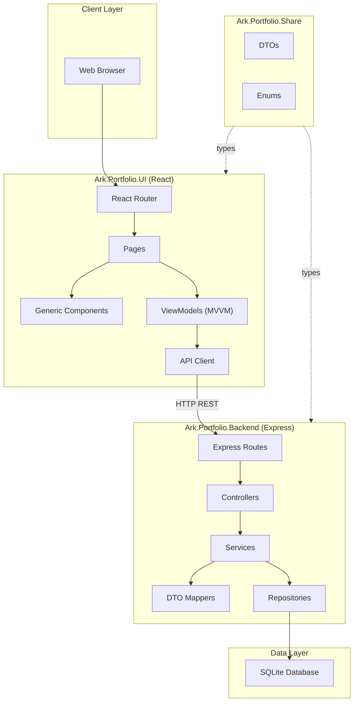
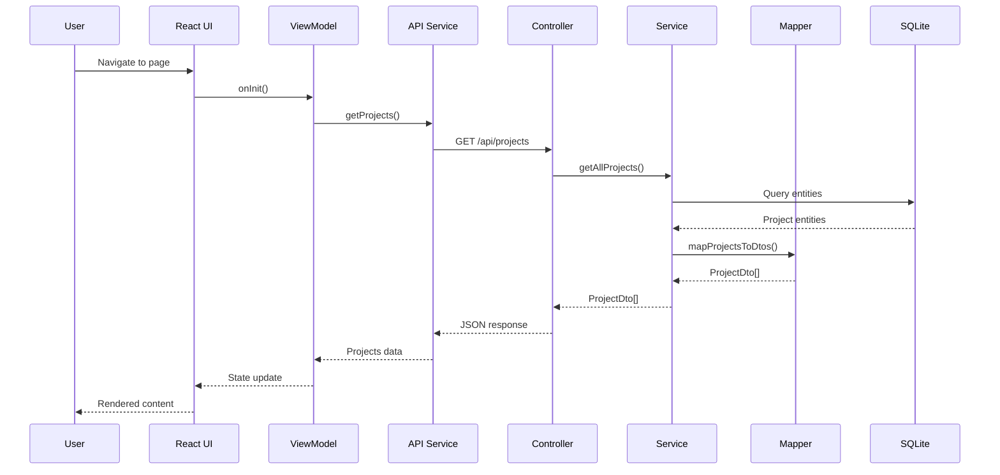

# Ark.Portfolio

**A Modern Developer Portfolio System**

A full-stack TypeScript monorepo for showcasing projects, experience, and skills with a premium cyberpunk-inspired design.

---

**Author**: Armand Richelet-Kleinberg  
**License**: MIT

---

## Table of Contents

- [Overview](#overview)
- [Architecture](#architecture)
- [Project Structure](#project-structure)
- [Getting Started](#getting-started)
- [API Reference](#api-reference)
- [Deployment](#deployment)
- [Dependencies](#dependencies)
- [Configuration](#configuration)

---

## Overview

Ark.Portfolio is a comprehensive portfolio system designed for developers and engineers to showcase their work. It features:

- **Hero Section**: Professional introduction with social links
- **Project Showcase**: Carousel and grid displays with rich project details
- **CV/Resume**: Education, experience, and skills presentation
- **Architecture Diagrams**: Mermaid-powered technical documentation
- **Modern UI**: Glassmorphism, animations, and responsive design

---

## Architecture

### System Overview



### Data Flow



---

## Project Structure

```
Ark.Portfolio/
├── Ark.Portfolio.Backend/       # Express.js REST API
│   ├── src/
│   │   ├── controllers/         # HTTP endpoint handlers
│   │   ├── services/            # Business logic
│   │   ├── mappers/             # Entity-to-DTO mappers
│   │   ├── database/            # TypeORM entities & repos
│   │   └── routes/              # Route definitions
│   └── README.md
│
├── Ark.Portfolio.Share/         # Shared TypeScript library
│   ├── dtos/                    # Data Transfer Objects
│   ├── enums/                   # Shared enumerations
│   ├── mocks/                   # Development mock data
│   └── README.md
│
├── Ark.Portfolio.UI/            # React frontend
│   ├── src/
│   │   ├── components/          # Reusable UI components
│   │   │   ├── base/            # MVVM base classes
│   │   │   └── generic/         # Generic components
│   │   ├── pages/               # Application pages
│   │   ├── api/                 # API client & services
│   │   └── styles/              # Global styles
│   └── README.md
│
├── Docs/                        # Additional documentation
└── README.md                    # This file
```

---

## Getting Started

### Prerequisites

- **Node.js** 18 or higher
- **npm** 9 or higher

### Installation

```bash
# Clone the repository
git clone https://github.com/ark/portfolio.git
cd Ark.Portfolio

# Install all dependencies
cd Ark.Portfolio.Share && npm install && cd ..
cd Ark.Portfolio.Backend && npm install && cd ..
cd Ark.Portfolio.UI && npm install && cd ..
```

### Development

```bash
# Terminal 1: Start Backend (port 8085)
cd Ark.Portfolio.Backend
npm run dev

# Terminal 2: Start Frontend (port 5173)
cd Ark.Portfolio.UI
npm run dev
```

Open http://localhost:5173 in your browser.

---

## API Reference

| Endpoint | Method | Description |
|----------|--------|-------------|
| `/api/profile` | GET | Portfolio owner profile |
| `/api/projects` | GET | All projects |
| `/api/projects/featured` | GET | Featured projects |
| `/api/projects/:id/presentation` | GET | Full project details |
| `/api/cv` | GET | Education, experience, skills |
| `/api/dashboard` | GET | Dashboard statistics |

---

## Deployment

### Docker Deployment

```bash
# Build and run with docker-compose
docker-compose up -d

# Or build images separately
docker build -t ark-portfolio-backend ./Ark.Portfolio.Backend
docker build -t ark-portfolio-ui ./Ark.Portfolio.UI
```

### Manual Deployment

1. Build the Share library:
   ```bash
   cd Ark.Portfolio.Share && npm run build
   ```

2. Build and start the Backend:
   ```bash
   cd Ark.Portfolio.Backend
   npm run build
   npm start
   ```

3. Build and serve the UI:
   ```bash
   cd Ark.Portfolio.UI
   npm run build
   # Serve the dist/ folder with your preferred web server
   ```

---

## Dependencies

### Backend
| Package | Purpose |
|---------|---------|
| express | Web framework |
| typeorm | ORM for database |
| sqlite3 | Database driver |
| cors | Cross-origin support |
| helmet | Security headers |
| dotenv | Environment config |

### Frontend
| Package | Purpose |
|---------|---------|
| react | UI library |
| react-router-dom | Routing |
| axios | HTTP client |
| chart.js | Data visualization |
| mermaid | Diagram rendering |
| lucide-react | Icons |
| tailwindcss | CSS framework |

### Shared
| Package | Purpose |
|---------|---------|
| typescript | Type safety |

---

## Configuration

### Environment Variables

**Backend** (`Ark.Portfolio.Backend/.env`):
```env
PORT=8085
DATABASE_PATH=./ark_portfolio.sqlite
```

**Frontend** (`Ark.Portfolio.UI/.env`):
```env
VITE_API_URL=http://localhost:8085/api
```

### Database

The application uses **SQLite** by default. On first startup:
- Database is auto-created
- Initial data is seeded automatically

To reset the database, delete `ark_portfolio.sqlite` and restart.

---

## License

MIT License

Copyright (c) 2024 Armand Richelet-Kleinberg

Permission is hereby granted, free of charge, to any person obtaining a copy
of this software and associated documentation files (the "Software"), to deal
in the Software without restriction, including without limitation the rights
to use, copy, modify, merge, publish, distribute, sublicense, and/or sell
copies of the Software, and to permit persons to whom the Software is
furnished to do so, subject to the following conditions:

The above copyright notice and this permission notice shall be included in all
copies or substantial portions of the Software.

THE SOFTWARE IS PROVIDED "AS IS", WITHOUT WARRANTY OF ANY KIND, EXPRESS OR
IMPLIED, INCLUDING BUT NOT LIMITED TO THE WARRANTIES OF MERCHANTABILITY,
FITNESS FOR A PARTICULAR PURPOSE AND NONINFRINGEMENT. IN NO EVENT SHALL THE
AUTHORS OR COPYRIGHT HOLDERS BE LIABLE FOR ANY CLAIM, DAMAGES OR OTHER
LIABILITY, WHETHER IN AN ACTION OF CONTRACT, TORT OR OTHERWISE, ARISING FROM,
OUT OF OR IN CONNECTION WITH THE SOFTWARE OR THE USE OR OTHER DEALINGS IN THE
SOFTWARE.
